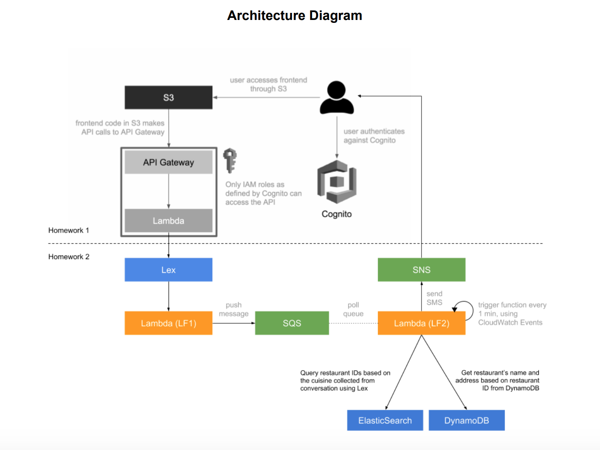

# Dinesphere Chatbot

## About
An intelligent dining concierge chatbot designed to provide personalized restaurant recommendations based on user input such as location, cuisine, time, and party size. Built with Amazon Lex for natural language understanding and AWS Lambda for backend processing, it seamlessly integrates with Amazon DynamoDB, OpenSearch, and SES to deliver a smooth and efficient user experience.

The project implements various AWS services, to create a chatbot that gathers information
from the user about a requested restaurant reservation, and sends a confirmation email.

## Files Included

1. Lambda Helper Functions 
2. SDK (for frontend)
3. Yelp Scrapper Code (both for DynamoDB and OpenSearch)

## Services Used
1. Amazon S3 - To host the frontend
2. Amazon Lex - To create the bot
3. API Gateway - To set up the API
4. Amazon SQS - to store user requests on a first-come basis
5. ElasticSearch Service - To quickly get restaurant ids based on the user preferences of cuisine collected from SQS
6. DynamoDB - To store the restaurant data collected using Yelp API
7. Amazon SNS - to send restaurant suggestions to users through SMS
8. Lambda - To send data from the frontend to API and API to Lex, validation, collecting restaurant data, sending suggestions using SNS.
9. Yelp API - To get suggestions for food
10. AWS Congito - For authentication

## Chat Architecture Diagram

## Chat Example

## Usage

1. Clone the repository.
2. Replace `/assets/js/sdk/apigClient.js` with your own SDK file from the API
   Gateway.
3. Open `chat.html` in any browser.
4. Start sending messages to test the chatbot interaction.
